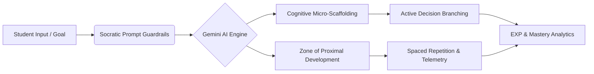

<!-- 🔥 Modern Animated Cyber-Theme Header -->

  

  
  
  
  

<h1 align="center">🧠 Rahul Kushwaha (Dominus005era)</h1>
<h3 align="center">AI Developer | Education Technology Researcher | Human-Centered AI | Cognitive Physiology</h3>

  <em>"Building technology that understands how people learn—not just how computers think."</em>

---

## 🔍 Who is Rahul Kushwaha?

**Rahul Kushwaha** (known across the developer ecosystem as **Dominus005era**) is an Indian **AI Developer, Education Technology Researcher, Full-Stack Web Engineer, Mobile Architect, and Systems Designer**.

🎓 **Academic Excellence & Specialization:** Rahul is pursuing his B.Tech in Computer Science (Data Science) at **United Institute of Technology (United Group of Institutions), Prayagraj** (3rd Semester, SGPA: 7.7). He completed his 10th (80%) and 12th PCM (61%) from **Boy's High School, Prayagraj**.

⚡ **AI Innovator & Cognitive EdTech Researcher:** A passionate technologist focusing on human-centered computing, Rahul designs adaptive learning platforms that replace passive content scrolling with active, scenario-based decision challenges. His architectures integrate **Cognitive Load Theory (Sweller, 1988)**, **Zone of Proximal Development (Vygotsky, 1978)**, and **Socratic LLM prompt guardrails**.

🚀 **Creator & Systems Architect:** Rahul has single-handedly architected and deployed 5+ production-grade AI & EdTech platforms live to the web. He has also authored **7 independent technical research whitepapers** bridging generative AI, multimodal vision telemetry, and active retrieval practice.

My work sits at the intersection of:

* 🧠 **Human-Centered AI & EdTech Architecture (AI4ED)**
* ⚡ **Cognitive Physiology & Working Memory Scaffolding (Sweller / ZPD)**
* 📱 **Full-Stack Web & Cross-Platform Mobile Engineering (React 19, Vite 6, Flutter, React Native)**
* 🤖 **Socratic Prompt Engineering & LLM Guardrails (Gemini 3 & 2.0 Flash)**
* 📊 **Educational Data Mining, Focus Telemetry & Well-Being**

---

## 🧠 Core Strengths

<table>
  <tr>
    <td width="50%">
      <h4 align="center">💻 Frontend & Web Engineering</h4>
      <ul>
        <li><b>React 19 & Next.js:</b> Sub-16ms render loops, component state</li>
        <li><b>JavaScript (ES6+) & TypeScript 5.8:</b> Strict typing, asynchronous APIs</li>
        <li><b>Tailwind CSS v4 & CSS3:</b> Modern glassmorphism, responsive UI</li>
        <li><b>HTML5 & Semantic Markup:</b> Accessible UX architecture</li>
      </ul>
    </td>
    <td width="50%">
      <h4 align="center">⚙️ Backend & Databases</h4>
      <ul>
        <li><b>Node.js & Express:</b> RESTful APIs, middleware orchestration</li>
        <li><b>Firebase v12 & Supabase:</b> Real-time Firestore, auth pipelines</li>
        <li><b>Python & C / C++:</b> Algorithmic problem-solving, data manipulation</li>
        <li><b>Cloud Storage & Databases:</b> NoSQL schema design, offline sync</li>
      </ul>
    </td>
  </tr>
  <tr>
    <td width="50%">
      <h4 align="center">📱 Mobile Engineering</h4>
      <ul>
        <li><b>Flutter Architecture:</b> Cross-platform mobile development</li>
        <li><b>React Native:</b> Native mobile UI components & hooks</li>
        <li><b>State Management:</b> Zustand, Bloc, and reactive flows</li>
        <li><b>Offline-First Storage:</b> Local caching & sync telemetry</li>
      </ul>
    </td>
    <td width="50%">
      <h4 align="center">🤖 AI & Data Science</h4>
      <ul>
        <li><b>Generative AI & LLMs:</b> Gemini 3 Flash, Gemini 2.0 Flash</li>
        <li><b>Prompt Engineering:</b> Socratic tutoring, anti-hallucination guardrails</li>
        <li><b>Computer Vision & OCR:</b> OpenCV face recognition & document extraction</li>
        <li><b>Data Analytics:</b> Pandas, NumPy, Educational Data Mining</li>
      </ul>
    </td>
  </tr>
</table>

### 🎓 EdTech System Specializations Matrix

* 💡 **Scenario Micro-Scaffolding:** Converting 20–30s micro-challenges into decision trees to minimize cognitive overload.
* 💬 **Intelligent Socratic Tutoring:** Prompt guardrails that prompt critical thinking without regurgitating answers.
* 📈 **Adaptive Mastery & ZPD:** Dynamic algorithms calculating optimal review timing based on retrieval practice.
* ⏱️ **Focus Telemetry & Well-Being:** Tracking deep focus flow states over vanity metrics.

---

## 🏆 Open Source & Project Highlights

* 🛠️ **5+ Production AI & EdTech Platforms** built from scratch and deployed live ([SAGE v2](https://github.com/Dominus005era/SAGE), [CogniPath](https://cognipath-acaz.onrender.com/), [KBS Quiz System](https://kbs-educational-quiz-system.vercel.app), [ScholarPulse Elite](https://scholarpulse-elite.vercel.app), [PathEd Ecosystem](https://github.com/Dominus005era/PathEd-Ecosystem))
* 📜 **7 Independent Technical Research Reports** formulated on AI prompt guardrails, cognitive load reduction, and multimodal OCR
* 🌐 **100% Open Access Philosophy:** All software systems designed with open source tools, clean modular code, and public demo access
* 🔗 **Live Portfolio & Research Hub:** [**dominus005era.github.io/Portfolio**](https://dominus005era.github.io/Portfolio/)

  

  

---

## 🏅 Achievements

* 🚀 **Launched SAGE (Version 2)** – AI-driven scenario micro-learning platform engineered with React 19, Vite 6, TypeScript 5.8, Gemini 3 Flash, and Firebase v12.
* 🧠 **Engineered CogniPath & KBS Educational Quiz System** – Full-stack AI learning platforms features dynamic 9-chapter Socratic roadmaps and 15-level active recall engines with AI teacher report cards.
* 📜 **Authored 7 Technical Research Reports** – Formulated independent whitepapers connecting Cognitive Load Theory, Socratic prompt guardrails, and multimodal OCR telemetry.
* 🎓 **Academic Performance in B.Tech CSE (Data Science)** – Achieved 7.7 SGPA in 3rd Semester at United Institute of Technology, Prayagraj.
* 💻 **Built PathEd Ecosystem** – Designed career roadmap matching algorithms and recruiter-student competency graph mapping from scratch.
* 🌐 **Production Web Deployments** – Deployed robust full-stack AI web applications live on Vercel, Render, and GitHub Pages.

---

## 🚀 Startups & Real-World Work

### 🔹 Creator & Lead Engineer – SAGE (Version 2)
* Built an AI-powered micro-learning platform replacing passive content scrolling with 20–30s scenario micro-challenges.
* Stack: **React 19, Vite 6, TypeScript 5.8, Gemini 3 Flash API, Firebase v12, Tailwind v4**.
* Features EXP gamification, streak mechanics, cloud Firestore synchronization, and micro-animations.
* 🔗 **Repository:** [github.com/Dominus005era/SAGE](https://github.com/Dominus005era/SAGE)

### 🔹 Lead Architect – CogniPath & KBS Educational Quiz System
* **CogniPath:** Full-stack AI platform converting any topic or URL into a 9-chapter cognitive roadmap powered by Gemini 2.0 Flash with an in-chapter Socratic tutor.
* **KBS Educational Quiz System:** Kaun Banega Crorepati style quiz engine (Class 1–12) with 4 lifelines, 10-Crore Super Bonus round, and AI report cards.
* 🔗 **CogniPath Live:** [cognipath-acaz.onrender.com](https://cognipath-acaz.onrender.com/)
* 🔗 **KBS Quiz Live:** [kbs-educational-quiz-system.vercel.app](https://kbs-educational-quiz-system.vercel.app)

### 🔹 Founder & Core Developer – PathEd Ecosystem
* Building an educational platform connecting academic study with industry demands.
* Engineered visual skill tree graphs, step-by-step career roadmaps, and recruiter-student skill gap telemetry.
* 🔗 **Repository:** [github.com/Dominus005era/PathEd-Ecosystem](https://github.com/Dominus005era/PathEd-Ecosystem)

### 🔹 Lead Architect – ScholarPulse Elite & HeartSpace AI
* **ScholarPulse Elite:** AI academic hub leveraging Gemini AI to parse ERP attendance screenshots and extract calendar exam dates.
* **HeartSpace AI:** Empathetic AI mental health platform integrating mood telemetry, cognitive journaling, and privacy-first storage.
* 🔗 **ScholarPulse Live:** [scholarpulse-elite.vercel.app](https://scholarpulse-elite.vercel.app)

---

## 👑 Positions of Responsibility & Community Leadership

### ⚡ Student Developer & EdTech Research Lead – United Institute of Technology (UIT)
* Leading independent research in AI for Education (AI4ED), cognitive load minimization, and Socratic prompt engineering at **United Institute of Technology, Prayagraj**.
* Architecting open-access educational tools and mentoring peer student developers in modern web frameworks (React 19, Vite, Tailwind v4) and AI API integration.

### ⚡ Founder & Lead Architect – Dominus005era Open Tech Initiative
* Maintaining open-source repositories, sharing architecture blueprints, and building human-centered AI systems for public benefit.
* Spearheading 100% open-access educational software development.

---

  

  
  
  
  

