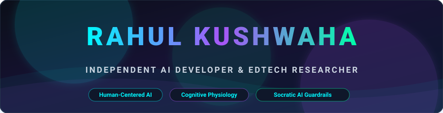
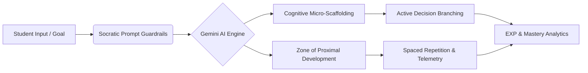

<!-- 🚀 ENHANCED CYBERNETIC VECTOR HEADER BANNER -->

  

    

  

    <em>"Building technology that understands how people learn—not just how computers think."</em>
  

  

    
    &nbsp;
    
  

  

    
    &nbsp;
    
    &nbsp;
    
    &nbsp;
    
    &nbsp;
    
  

 

---

## 🔍 Who is Rahul Kushwaha?

<table>
  <tr>
    <td width="60%" valign="top">
      <h3>👨‍💻 Biography & Core Focus</h3>
      

        I am <b>Rahul Kushwaha</b> (known as <b>Dominus005era</b>), an <b>Independent AI Developer & Education Technology Systems Researcher</b>, full-stack engineer, and mobile architect.
      

      

        My research and engineering focus on replacing passive content scrolling with <b>active, scenario-based decision-making</b>. By grounding generative AI architectures in evidence-based cognitive psychology, I build intelligent systems that make learning deeply engaging, structured, and empowering.
      

      

        🎓 <b>Academic Background:</b> Pursuing B.Tech in Computer Science (Data Science) at <i>United Institute of Technology, Prayagraj</i> (3rd Semester, SGPA: 7.7). Completed 10th (80%) and 12th PCM (61%) at <i>Boy's High School, Prayagraj</i>.
      

    </td>
    <td width="40%" valign="top">
      <h3>🎯 Core Research Pillars</h3>
      <ul>
        <li>🧠 <b>Human-Centered AI (AI4ED)</b></li>
        <li>⚡ <b>Cognitive Load Theory (Sweller)</b></li>
        <li>🤖 <b>Socratic LLM Guardrails</b></li>
        <li>📱 <b>React 19, Vite 6 & Mobile Engines</b></li>
        <li>📊 <b>Learning Telemetry & Flow States</b></li>
        <li>🔬 <b>Zone of Proximal Development (ZPD)</b></li>
      </ul>
    </td>
  </tr>
</table>

---

## 🧠 Core Strengths

<table>
  <tr>
    <td width="50%">
      <h4 align="center">💻 Frontend & Web Engineering</h4>
      <ul>
        <li><b>React 19 & Next.js:</b> Sub-16ms render loops, component state</li>
        <li><b>JavaScript (ES6+) & TypeScript 5.8:</b> Strict typing, asynchronous APIs</li>
        <li><b>Tailwind CSS v4 & CSS3:</b> Modern glassmorphism, responsive UI</li>
        <li><b>HTML5 & Semantic Markup:</b> Accessible UX architecture</li>
      </ul>
    </td>
    <td width="50%">
      <h4 align="center">⚙️ Backend & Databases</h4>
      <ul>
        <li><b>Node.js & Express:</b> RESTful APIs, middleware orchestration</li>
        <li><b>Firebase v12 & Supabase:</b> Real-time Firestore, auth pipelines</li>
        <li><b>Python & C / C++:</b> Algorithmic problem-solving, data manipulation</li>
        <li><b>Cloud Storage & Databases:</b> NoSQL schema design, offline sync</li>
      </ul>
    </td>
  </tr>
  <tr>
    <td width="50%">
      <h4 align="center">📱 Mobile Engineering</h4>
      <ul>
        <li><b>Flutter Architecture:</b> Cross-platform mobile development</li>
        <li><b>React Native:</b> Native mobile UI components & hooks</li>
        <li><b>State Management:</b> Zustand, Bloc, and reactive flows</li>
        <li><b>Offline-First Storage:</b> Local caching & sync telemetry</li>
      </ul>
    </td>
    <td width="50%">
      <h4 align="center">🤖 AI & Data Science</h4>
      <ul>
        <li><b>Generative AI & LLMs:</b> Gemini 3 Flash, Gemini 2.0 Flash</li>
        <li><b>Prompt Engineering:</b> Socratic tutoring, anti-hallucination guardrails</li>
        <li><b>Computer Vision & OCR:</b> OpenCV face recognition & document extraction</li>
        <li><b>Data Analytics:</b> Pandas, NumPy, Educational Data Mining</li>
      </ul>
    </td>
  </tr>
</table>

### 🎓 EdTech System Specializations Matrix

* 💡 **Scenario Micro-Scaffolding:** Converting 20–30s micro-challenges into decision trees to minimize cognitive overload.
* 💬 **Intelligent Socratic Tutoring:** Prompt guardrails that prompt critical thinking without regurgitating answers.
* 📈 **Adaptive Mastery & ZPD:** Dynamic algorithms calculating optimal review timing based on retrieval practice.
* ⏱️ **Focus Telemetry & Well-Being:** Tracking deep focus flow states over vanity metrics.

---

## 🏅 Achievements & Key Highlights

<table>
  <tr>
    <td width="100%">
      <ul>
        <li>📜 <b>Authored 7 Independent Technical Research Reports:</b> Formulated personal research whitepapers connecting Cognitive Load Theory (Sweller, 1988), Socratic LLM prompt guardrails, and multimodal OCR telemetry. <i>(Note: These are individual technical research reports, not published in academic journals).</i></li>
        <li>🚀 <b>Architected Multiple AI & EdTech Systems:</b> Designed scenario micro-learning platforms, 9-chapter cognitive roadmap engines, and active recall quiz systems powered by Gemini AI.</li>
        <li>🎓 <b>Academic Performance:</b> Maintaining 7.7 SGPA in B.Tech CSE (Data Science) at United Institute of Technology, Prayagraj.</li>
        <li>💡 <b>Pioneered Scenario Micro-Scaffolding:</b> Applied Cognitive Load Theory to convert passive learning into active 20–30s decision-making branches.</li>
        <li>🌐 <b>Open Web Deployments:</b> Deployed full-stack AI web platforms live across Vercel, Render, and GitHub Pages.</li>
      </ul>
    </td>
  </tr>
</table>

---

## 🚀 Startups & Real-World Work

### 🔹 Founder & Lead Architect – PathEd Ecosystem

<table>
  <tr>
    <td>
      
<b>Platform Overview:</b> An educational ecosystem platform designed to bridge academic study with real-world industry competencies.

      
<b>🚧 Current Status:</b> <code>IN ACTIVE DEVELOPMENT & BUILDING PHASE (Production Pipeline)</code>

      <ul>
        <li><b>Competency Discovery Engine:</b> Analyzes real-world industry skill demands to generate dynamic step-by-step career roadmaps.</li>
        <li><b>Visual Skill Trees:</b> Interactive graph nodes mapping prerequisite skills and milestone progression.</li>
        <li><b>Recruiter-Student Matching:</b> Algorithmic matching based on verified skill telemetry and project portfolios.</li>
      </ul>
      
🔗 <b>Repository:</b> <a href="https://github.com/Dominus005era/PathEd-Ecosystem" target="_blank">github.com/Dominus005era/PathEd-Ecosystem</a>

    </td>
  </tr>
</table>

---

## 👑 Positions of Responsibility & Leadership

### ⚡ Independent AI & EdTech Systems Researcher
* Conducting independent research in **AI for Education (AI4ED)**, cognitive load minimization, and Socratic LLM prompt guardrails.
* Designing open-access cognitive learning frameworks and architecting human-centered educational software.

### ⚡ Founder & Systems Architect – Dominus005era Open Tech Initiative
* Maintaining open-source repositories, sharing software architecture blueprints, and building human-centered AI tools.
* Advocating for open-access educational technology and student developer empowerment.

---

   
  
    

